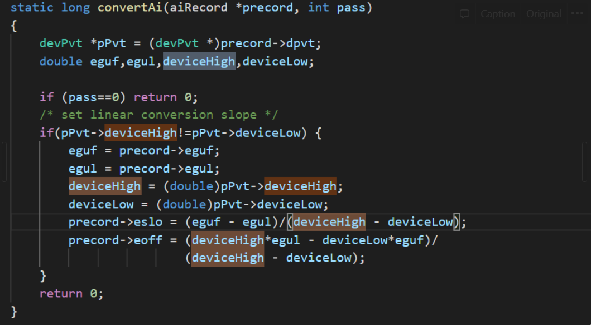
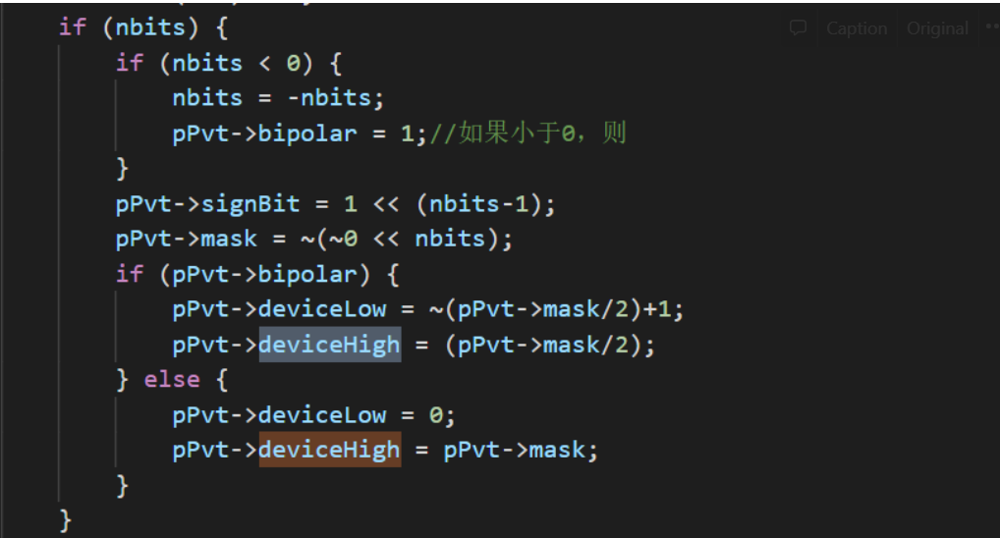
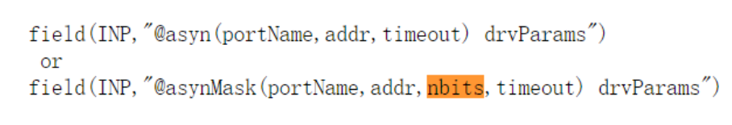

### ai记录的单位转换

首先，参考[记录参考手册](https://epics.anl.gov/base/R3-15/8-docs/aiRecord.html)的说明，对于读进来的数据，ai记录有如下的处理规则：

在LINR字段指定为LINEAR or SLOPE就执行下面的公式：

```
（（（RVAL+ROFF）*ASLO+AOFF）*ESLO）+EOFF
```

SLOPE转换要求用户计算合适的乘积和偏置因子，即手动计算ESLO和EOFF。

而LINEAR需要用户设置EGUL，EGUF为硬件可以转换的最大的工程单位，硬件设备支持可以知道原始数据的范围并且计算ESLO和EOFF。当用户正确设置了EGUF之后，计算ESLO和EOFF的公式如下所示：

```
EOFF = (RVAL_max * EGUL − RVAL_min * EGUF) / (RVAL_max − RVAL_min)
ESLO = (EGUF − EGUL) / (RVAL_max − RVAL_min)
```

这里顺带介绍一下SMOO这个字段，这个字段用来实现**平滑滤波器**。

SMOO字段的数字范围是0-1间的双精度小数，其中，0表示不使用，1表示VAL字段不会发生变化。

SMOO字段同样是对原始的VAL进行处理的字段，其转换的公式如下：

```
VAL = VAL * SMOO + (1 - SMOO) * New Data
```

其中，New Data已经经过LINR字段指定的变换，实际上是利用了SMOO实现了带有z平面极点的一阶无限脉冲响应（IIR）数字滤波器，其多项式方程如下所示：

```
y(n)=y(n)*SMOO+(1-SMOO)*y(n+1)
```

这个是为了实现数据的抗噪声。等效的模拟滤波器时间常数是：-T / ln（SMOO）

 其中T为记录处理之间的时间。


不过，对于ai记录的单位转换问题，有必要聊一聊。

其中，LINR=SLOPE是最常见的模式，因为允许用户来根据自己的实际情况来将获得的值转换为自己想要的结果。下面以一个例子来说明ESLO和EOFF的设置。

假定设备的寄存器返回的数据的范围是0-65535，但是数据本身的物理意义的范围是0-6553.5，那么，在aiRecord接收到硬件设备的val值得时候，应当对该VAL值做一个转换，此时根据公式，ESLO=0.1.

而如果还希望对乘过ESLO的VAL添加一个偏置值得时候，应该设置EOFF为希望添加的偏置值。


LINR=LINEAR的时候，我们指定的ESLO和EOFF就不会生效。ESLO将由设备可能读入的最大值和最小值决定，即利用下面的式子：

```
ESLO = (EGUF − EGUL) / (RVAL_max − RVAL_min)
```

根据源码，我们可以找到RVAL_max和RVAL_min的位置如下：



而devicehigh由nbits确定如下所示：



nbits可以由字段中的INP指定：



不过，这里的nbits只能指定为

```
   0 to 2^nbits-1
```

或者

```
 2^(abs(nbits)-1) to 2^((abs(nbits)-1)-1
```


在实际的工作中，出现了转换关系是一个无限循环小数的表示的比例关系，这个时候经过权衡，还是用SLOPE的方式来实现。因为ESLO是double类型，可以表示13-14位小数，对于一般情况下，此时产生的误差可以忽略不计。如果使用LINEAR的模式，注意指定deviceHigh，可以通过INP来指定。

