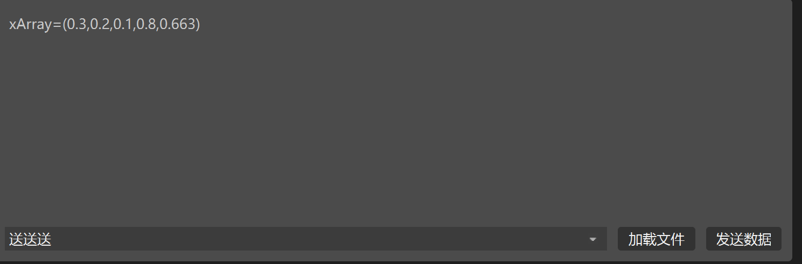

#### 利用Stramdevice从硬件读取waveform数据

**调试结果：**

在windows端利用调试工具野火网络调试助手，本地ip设置为windows段ip地址210.45.77.76，配置端口号502，启动tcp server。

在linux,端设置ip为210.45.77.77。当野火助手按如下格式发送的时候：



linux端的waveform可以读入数据。

因此，希望硬件传送数据的格式如上图所示。

##### 调试关键步骤

1.首先保证linux和windows的联通。配置两台机器在同一网段。可以用ping命令测试。

2.注意linux的防火墙，关闭对应的端口号。

3.配置编写对应的ioc文件。


IOC文件的配置主要是三个地方，一个是st.cmd的写法，另一个是协议的写法，还有一个是db文件的写法。

db文件的写法,这里waveform的配置其实主要是配置一下INP输入，是通过getACC这个协议中规定的语句接收。同时配置SCAN为触发模式，即只有当输入为一定类型的时候waveform才将输入的数据读入。FTVL配置了waveform读取的数据的类型为float类型，NELM配置了waveform一次可以存储的最大个数，该个数可以配置地很大ulong。

```
record(waveform,"xAxis"){
field(DTYP,"stream")
field(INP,"@wavetest.proto getACC mybus")
field(SCAN,"I/O Intr")
field(FTVL,"FLOAT")
field(NELM,"10")
field(DESC, "test")
}

record(ai,"aitest"){
field(DTYP,"stream")
field(INP,"@wavetest.proto getTest mybus")
#field(SCAN,"1 second")
#filed(FTVL,"SHORT")
#filed(NELM,"10")
field(DESC, "test")
}
```

st.cmd的写法：

这里的重点是调用drvAsynIPPortConfigure函数，“mubus"这个设备名是自己定义的，只要db和这里定义的一致就可以。但是注意ip地址和端口号要配置正确，windows端的端口要和这里的端口配置一致。

```
## You may have to change waveformTest to something else
## everywhere it appears in this file

< envPaths

cd "${TOP}"

## Register all support components

epicsEnvSet("STREAM_PROTOCOL_PATH","${TOP}/protocols")

dbLoadDatabase "dbd/waveformTest.dbd"
waveformTest_registerRecordDeviceDriver pdbbase

drvAsynIPPortConfigure("mybus","210.45.77.76:502",0,0,0)
## Load record instances
dbLoadRecords("db/waveformTest.db","user=root")

cd "${TOP}/iocBoot/${IOC}"
iocInit

## Start any sequence programs
#seq sncxxx,"user=root"
```

协议的写法：协议写法参见StreamDevice，这里就是StreamDevice的例子。这里可以类比C语言，%f就是float类型的占位符。

```
getAcc{
separator=",";
in "xArray=(%f)";
}

getTest{
in "%r";
}
```

